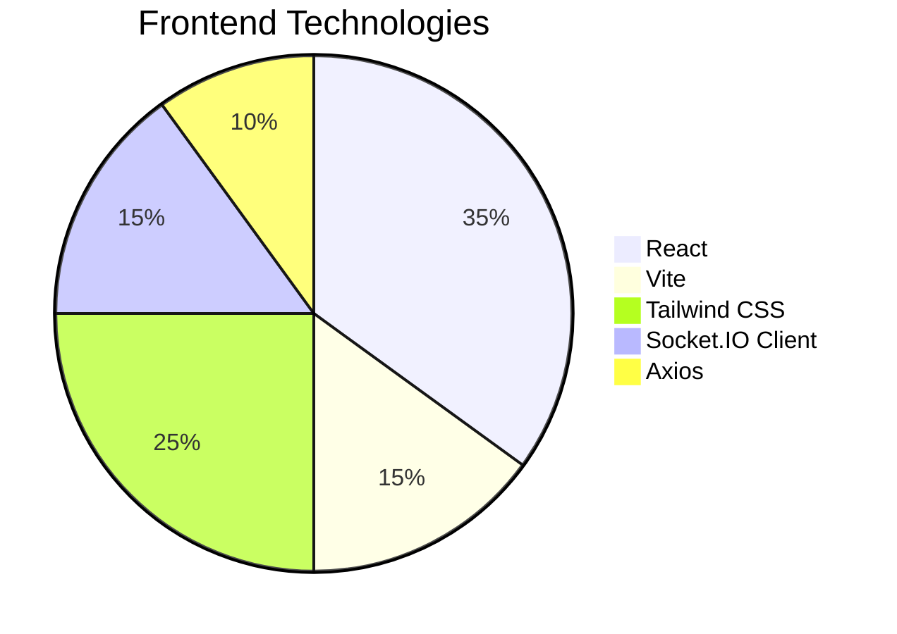

# QuickChat - Real-time MERN Stack Chat Application

## 📌 Overview
Real-time chat application built with:
- **M**ongoDB (Database)
- **E**xpress.js (Backend framework)
- **R**eact (Frontend library)
- **N**ode.js (Runtime)
- Socket.IO (Real-time communication)

## ✨ Features
| Feature | Description |
|---------|-------------|
| ⚡ Real-time Messaging | Instant message delivery with Socket.IO |
| 🔐 JWT Authentication | Secure user signup/login flow |
| 👥 Private Chats | One-on-one conversations |
| 🖼️ Media Sharing | Image uploads via Cloudinary |
| 💬 Online Status | Live user presence indicators |
| 🔔 Unread Counts | Visual indicators for new messages |
| 🎨 Custom Profiles | Personalized avatars & bios |
| 📱 Responsive UI | Mobile-friendly Tailwind CSS design |

## 🛠️ Tech Stack
### Frontend

-----
## Proejct Structure
quickchat/
├── client/               # React Frontend
│   ├── src/              # Source files
│   └── dist/             # Production build
└── server/               # Node.js Backend
    ├── controllers/      # Route handlers
    ├── models/           # MongoDB schemas
    ├── routes/           # API endpoints
    └── server.js         # Entry point

